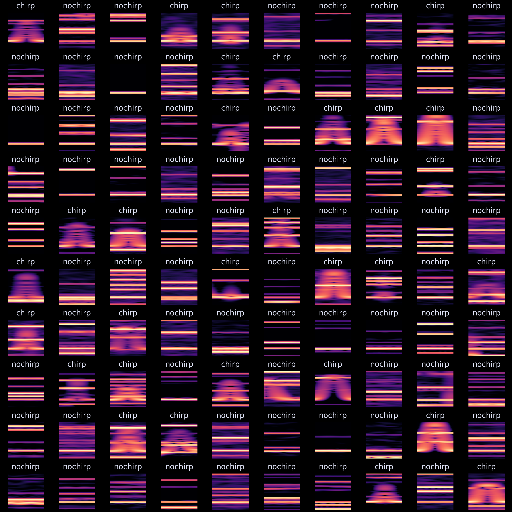

# ChirpCNN

Let's try to improve chirp detection with deep learning.

## Approach

1. Simulate a labeled dataset 
2. Train a binary classifier to detect chirps in spectrogram snippets. The current version is a basic CNN implemented in Pytorch.
3. Slide a window along the frequency track of a single track and apply the classifier on each sliding window
4. Clean-up: Group chirps if they are detected multiple times

The main problem of chirp detection is, that chirps are too fast to resolve the temporal evolution in frequency, while maintaining a frequency resolution to distinguish individual fish on a spectrogram. A spectrogram of a chirp with sufficient frequency resolution does **not** capture a chirp well. But on these spectrograms, we can still see the "ghost" of a chirp: The chirp might not be clearly visible in its temporal evolution, but there is a blurred region where the frequency briefly peaks. But these regions last up to magnitudes longer than a real chirp and come in many shaped and forms, depending on the spectrogram resolution and parameters such as chirp duration, contrast, frequency, etc. The following image contains just a few examples from the current dataset. Each window is fixed to a frequency range of 300 Hz and a time of 240 ms.

In this project, I will build a simulated dataset using many chirp parameters and will then try to train a CNN to detect these "ghosts" of chirps on spectrogram images.

## Issues

- A chirp only lasts for 20-200 ms but the anomaly it introduces on a spectrogram with sufficient frequency resolution lasts up to a second. 
- The classifier might be able to detect chirps well, but assigning them to the correct emitter is a seperate problem.

## To do 

- [x] Create a synthetic dataset 
- [x] Build a classifier
- [ ] Add more variation to the dataset
- [ ] Retrain and test the classifier
- [ ] Implement window-sliding on actual data 
- [ ] Output validation on real data
