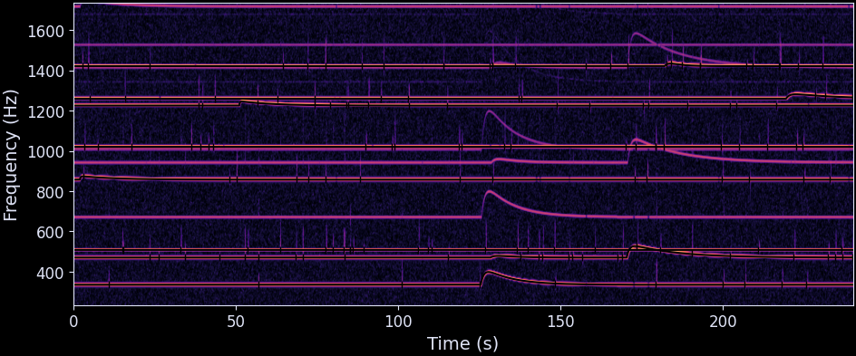

# ChirpCNN

Some weakly electric fish produce chirps to communicate. Let's try to improve chirp detection with a convolutional neural network. 

## What are chirps?

Chirps are brief (20-200 ms) upward-excursions of the frequency of the electrid organ discharge (EOD) of many wave-type electric fish. The example below shows a simulation of the EOD of a single fish that chirps 50 times. Every black line is a frequency band of a single fish. Each black tick is the time point a chirp is simulated. The additional frequency bands are harmonics.

## How can we detect them?

1. Simulate a labeled dataset 
2. Train a binary classifier to detect chirps in spectrogram snippets. The current version is a basic CNN implemented in Pytorch.
3. Slide a window along the frequency track of a single track and apply the classifier on each sliding window
4. Clean-up: Group chirps if they are detected multiple times

The main problem of chirp detection is, that chirps are too fast to resolve the temporal evolution in frequency, while maintaining a frequency resolution to distinguish individual fish on a spectrogram. A spectrogram of a chirp with sufficient frequency resolution does **not** capture a chirp well. But on these spectrograms, we can still see the "ghost" of a chirp: The chirp might not be clearly visible in its temporal evolution, but there is a blurred region where the frequency briefly peaks. But these regions last up to magnitudes longer than a real chirp and come in many shaped and forms, depending on the spectrogram resolution and parameters such as chirp duration, contrast, frequency, etc. The following image contains just a few examples from the current dataset. Each window is fixed to a frequency range of 400 Hz and a time of 240 ms.

In this project, I will build a simulated dataset using many chirp parameters and will then try to train a CNN to detect these "ghosts" of chirps on spectrogram images.

With this synthetic dataset, I reach a discrimination performance of 99%. But as soon as the frequency traces of chirping fish get close, the current version of the detector falsely assings the same chirp to multiple fish. The plot below illustrated the current state (2023/04/10, 00:27). 

## Issues

- A chirp only lasts for 20-200 ms but the anomaly it introduces on a spectrogram with sufficient frequency resolution lasts up to a second. 
- The classifier might be able to detect chirps well, but assigning them to the correct emitter is a seperate problem.

## To do 

- [x] Create a synthetic dataset 
- [x] Build a classifier
- [x] Build a global yaml config for spectrogram & detection parameters
- [x] Add more variation to the dataset
- [x] Retrain and test the classifier
- [ ] Explore how parameters change performance
  - [ ] CNN parameters (training rate, batch size, ...)
  - [ ] Image processing, cropping, ...
- [ ] Add real data to the classifier
- [ ] Retrain and test 
- [ ] Implement window-sliding 
  - [x] Sliding windows + detection in RAM
  - [x] Understand why sliding window detection performance is much worse than train-test performance
    - NOTE: I just noticed that I added variation to all chirp parameters except for the phase of the EOD in which the chirp is produced. This is currently the most likely explanation.
  - [ ] Sliding windows + detection by writing windows to disk for large datasets 
  - [ ] Group chirps that are detected multiple times close to each other. This issue was to be expected with the sliding window approach.
  - [ ] Currently I use frequency tracks sampled in the same rate as the original signal. Implement, that I can utilize the frequency tracks form the wavetracker instead.
- [ ] Output validation on real data & simulated grid datasets 
