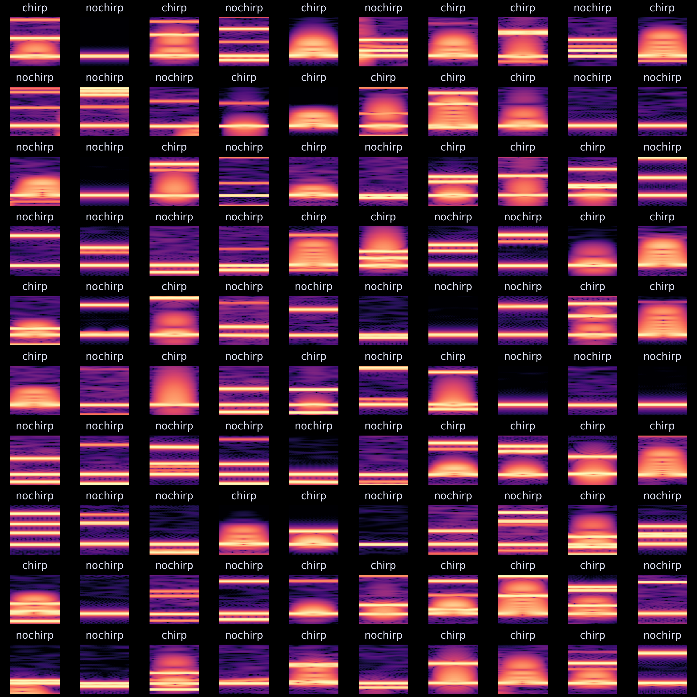

# ChirpNet - A chirp detection algorithm built on top of a convolutional neural network

The previous [chirp detection algorithm](https://github.com/weygoldt/chirpdetector) was based entirely on manual extraction of multiple features across time and space, where anomalies on a all features at the same time were chirps. **This** approach uses the sum spectrogram across all electrodes on an electrode grid to detect chirps from the spectrogram images. The core of this algoritm is a simple convolutional neural network that is trained to discriminate chirps using a simulated dataset. The detected chirps are then sorted on both the time and frequency dimension according to the models chirp probability.

## What are chirps?

Chirps are brief (20-200 ms) upward-excursions of the frequency of the electrid organ discharge (EOD) of many wave-type electric fish. The example below shows a simulation of the EODs of multiple fish that each chirp 50 times at random points in time. Every black line is a frequency band of a single fish. Each black tick is the time point a chirp is simulated. The additional frequency bands are harmonics.


## How can we **detect** them?

The main problem of chirp detection is, that chirps are too fast to resolve the temporal evolution in frequency, while maintaining a frequency resolution to distinguish individual fish on a spectrogram. A spectrogram of a chirp with sufficient frequency resolution does **not** capture a chirp well. If there is just a single fish in the recording, we could just filter the recording and compute an instantaneous frequency, but once there are multiple fish, the only way to separate them is by spectral analyses.

So the kind of spectrogram we need is a trade-off between the temporal and frequency resolution. We already extracted the bands of the EOD baseline frequency for each fish using a spectrogam with a frequency resolution of 0.5 Hz in the [wavetracker](https://github.com/tillraab/wavetracker) project. Most chirps are invisible on a spectrogram with this resolution. I currently use a frequency resolution of 6 Hz with a window overlap of .99. 

On these spectrograms, we can still see the "ghost" of a chirp: The chirp might not be clearly visible in its temporal evolution, but there is a blurred region where the frequency briefly peaks. But these regions last up to magnitudes longer than a real chirp and come in many shaped and forms, depending on the spectrogram resolution and parameters such as chirp duration, contrast, frequency, etc. The following image contains just a few examples from the current dataset. Each window is fixed to a frequency range of 400 Hz and a time of 240 ms.



In this project, I will build a simulated dataset using many chirp parameters and will then try to train a simple convolutional neural network as a binary image classifier to detect these "ghosts" of chirps on spectrogram images.

With the current synthetic dataset (n=15000), I reach a discrimination performance of 98%. But as soon as the frequency traces of chirping fish get close, the current version of the detector falsely assings the same chirp to multiple fish. The plot below illustrated the current state, the first try of detecting on non-artificial data.


The black markers are the points were the detector found a chirp. So what the current implementation solves, is reliable detection (on simulated data) but assignment is still an issue. As seen on the plot, when frequency bands are close to each other, one chirp is often detected on two frequency bands. I might be able so solve with an algorithmic approach, similarly to the non-cnn chirp detector.

**UPDATE:** The chirps that are falsely detected twice for different fish can be sorted by the probability the network computes for each chirp. Simply only accepting the chirp with the highest probability in a given time window (currently 20 ms) completely resolves the issue of duplicates on the current test snippet.

## Issues

- [x] A chirp only lasts for 20-200 ms but the anomaly it introduces on a spectrogram with sufficient frequency resolution lasts up to a second. 
  - Note: Chirps are often further apart than that and the current implementation detects them well even if they are close. This is only results in issues when the *exact* timing of a chirp is important and the chirp rate is high.
- [x] The classifier might be able to detect chirps well, but assigning them to the correct emitter is a seperate problem.
  - Note: Here I could borrow methods from the previous chirp detector, that was good at assignment but not so good with detection.
  - Current solution: If the a multiple chirps are detected simultaneously for multiple fish, discarding all chirps except for the one with the highest class probability is sufficient for now to correctly assing chirps. This of course biases the detector to not beeing able to detect simultaneous chirps. So this is **not fully solved**.
- [x] Understand why detection of real data is completely broken after switching to pytorch gpu accelerated spectrograms. Detection of fake data still works well. There is probably a processing step I either duplicated or left out somewhere. Need to find the time to dig in to this. Before switching, detection worked flawlessly. But had to switch to try out larger datasets.
  - NOTE: Because the pytorch image interpolation function produces different results than opencv.

## How to run this setup

This project is currently in early development but you can participate! I purposely build this in a way that should make setup easy on any machine. 

1. Clone the repository
```sh
git clone https://github.com/weygoldt/chirp-cnn.git && cd chirp-cnn
```
2. Make a virtual environment by your preferred method and activate, e.g.
```sh
pyenv virtualenv 3.11.2 chirpcnn 
pyenv local chirpcnn
# or with the built in venv
python -m venv chirpcnn
source .chirpcnn/bin/activate
```
3. Install dependencies
Two things need to be installed from git to run the simulations. The rest can 
be installed from the requirements.txt.
```sh
pip install git+https://github.com/janscience/audioio.git
pip install git+https://github.com/janscience/thunderfish.git
pip install -r requirements.txt
```
4. Run the complete loop by executing the `run.py` 

This will

  - Delete all data you might have generated previously
  - Generate a simulated dataset 
  - Train the model and outputs the model performance on the train-test split
  - Generate a new dataset 
  - Run the `detector.py` detection algorithm that uses the model to find chirps on the spectrogram.

After this pipline is finished, you will be rewarded by the plot above that shows the detections on the spectrogram.

## To do 

- [x] Create a synthetic dataset 
- [x] Build a classifier
- [x] Build a global yaml config for spectrogram & detection parameters
- [x] Add more variation to the dataset
- [x] Retrain and test the classifier
- [ ] Explore how parameters change performance
  - [ ] CNN parameters (training rate, batch size, ...)
  - [ ] Image processing, cropping, ...
  - [ ] Implement image transforms the generalize further 
  - [ ] Look into the ray-tune system for painless hyperparameter optimization
- [x] Add real data to the classifier
- [ ] Retrain and test 
- [x] Implement window-sliding 
  - [x] Sliding windows + detection in RAM
  - [x] Change sliding window to on-the-fly detection to support larger datasets. Currently it does batch detection
  - [x] Understand why sliding window detection performance is much worse than train-test performance
    - NOTE: I just noticed that I added variation to all chirp parameters except for the phase of the EOD in which the chirp is produced. This is currently the most likely explanation.
  - [x] Sliding windows + detection by writing windows to disk for large datasets
    - NOTE: I discarded this idea. Rather, I aim towards on the fly detection. The full spectrogram should be computed beforehand and the detector just loads that.
  - [x] Group chirps that are detected multiple times close to each other. This issue was to be expected with the sliding window approach.
    - NOTE: I did this by using the peaks of the chirp probabilities, which works quite well for now. But it would be more elegant to weigh the timestamps for all single detected chirps by their chirp probablility and compute the mean of that. This is probably more temporally accurate.
  - [ ] Implement a full post-processing pipeline to determine to which fish the chirps belong that are detected simultaneously on fish with close baseline EODfs.
  - [x] Currently I use frequency tracks sampled in the same rate as the original signal. Implement, that I can utilize the frequency tracks form the wavetracker instead.
- [ ] Output validation on real data & simulated grid datasets 
- [ ] In the animation plotting routine, redo the colors and add the real chirps onto the track of the sliding window
- [ ] Add a line plot with the estimated probability to the detector
- [ ] Understand the training loss, etc. Implement a training loss plot that shows how training went. This is absolutely urgent to prevent overfitting!
- [ ] Implement norm. Until now, each snippet is min-max normed before entering the network. This removes information that could be used during detection.
  - [ ] Standardize dataset before feeding it to the network and remove min max norm in data simulation script.
  - [ ] Try batch norming the output of the convolution layers.
- [ ] Get natural values for the chirp contrast. It from the spectrogram inversion experiment, it seems that natural contrasts are much stronger and could show on a spectrogram. This could be useful for the convnet detection.
- [ ] Try drastically increase the batch size, e.g. to 100
- [ ] Implement tensor-based detection on gpu instead of numpy.
- [ ] Implement the ability to load much larger spectograms without having to load it into ram
- [x] Implement the creation of large spectrograms on the GPU according to the detection parameters in the config file.
- [x] Buid a universal dataclass that the detector uses to load data. It should load the minimum amount of data necessary to run the detector and it should be able to load NIX datasets and wavetracker datasets. I am not sure how to implement this yet. Maybe built a seperate class for each and then have a factory that returns the correct class depending on the files in the input folder.
- [ ] Understand how I can get the probabilities from the cross entropy loss function directly instead of adding a softmax.
- [ ] Understand why training dataset spec computation fails on GPU. Implement generalized spec function that uses rolling windows automatically if array size becomes too large.
- [ ] Instead of the peak prob use the probs to weight the timestamps and compute the mean of that. This should be more accurate. This should also further alleviate the problem of multiple detections of the same chirp.
- [ ] Move hard coded time tolerance to config and clean and restructure config.

## Project log 
- 2023/04/14: Probably solved the issue that the same chirp is detected twice for two fish. I just take group chirps that are less than 20 ms apart and use only the one with the highest probability reported by the model and discard the rest. Even fancier implementations could use things like the dip in the baseline envelope during a chirp to determine to which fish the chirp truly belongs to.
- 2023/04/13: First time all chirps are correctly assigned on the real data snippet. Decraesed frequency resolution of the training dataset and made windows narrower.
- 2023/04/12: First semi-successfull run on a snippet of real data. 
- 2023/04/09: First successfull run of the detector on synthetic data.
